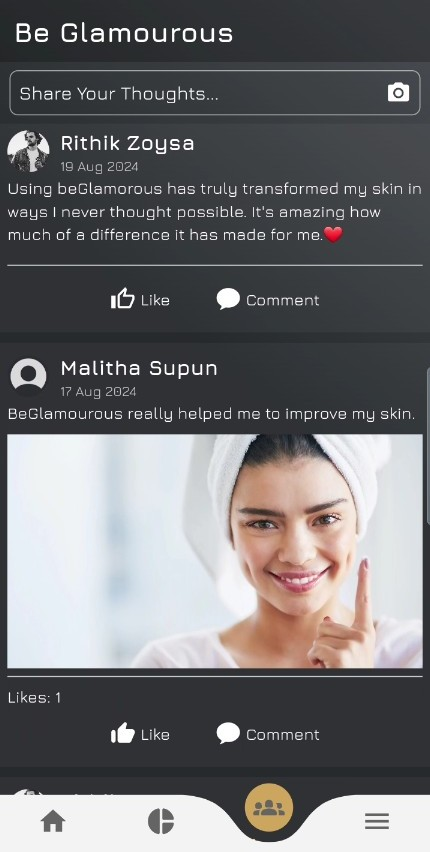

# Be Glamourous

**Be Glamourous** is an AI-powered mobile application that analyzes facial skin conditions from selfies and provides personalized skincare recommendations. The app also includes a social platform where users can share experiences, reviews, and skincare tips.

## Features
- **AI-Powered Facial Analysis** – Detects skin conditions using the YOLOv8 model.
- **Personalized Skincare Recommendations** – Suggests suitable skincare products based on skin analysis.
- **Social Platform** – Allows users to share insights, reviews, and experiences.
- **User Authentication** – Secure login and signup system.

## Screenshots
-  **Landing Screen**
-  **Home Screen**
-  **AI-Powered Facial Analysis**
-  **Social Platform**

## Technologies Used
- **Frontend:** Flutter (Dart)
- **Backend:** Node.js (Express.js)
- **AI Model:** Python, YOLOv8, Flask
- **Database:** MySQL
- **Security:** JWT Authentication, SHA Encryption
- **Version Control:** Git & GitHub

## Installation
### Prerequisites
- Install **Flutter**: [Flutter Installation Guide](https://flutter.dev/docs/get-started/install)
- Install **Node.js** & **npm**: [Node.js Download](https://nodejs.org/)
- Install **Python**: [Python Download](https://www.python.org/downloads/)
- Install **MySQL**: [MySQL Download](https://www.mysql.com/downloads/)

### Clone the Repository
```bash
 git clone https://github.com/your-username/be-glamourous.git
 cd be-glamourous
```

### Backend Setup
1. Navigate to the backend directory:
   ```bash
   cd backend
   ```
2. Install dependencies:
   ```bash
   npm install
   ```
3. Start the backend server:
   ```bash
   npm start
   ```

### AI Model Setup
1. Navigate to the AI directory:
   ```bash
   cd ai_model
   ```
2. Install dependencies:
   ```bash
   pip install -r requirements.txt
   ```
3. Start the Flask API:
   ```bash
   python app.py
   ```

### Frontend Setup
1. Navigate to the Flutter app directory:
   ```bash
   cd frontend
   ```
2. Install dependencies:
   ```bash
   flutter pub get
   ```
3. Run the app:
   ```bash
   flutter run
   ```

## Usage
1. Sign up or log in.
2. Upload a selfie to analyze your skin.
3. View personalized skincare recommendations.
4. Engage with the community by sharing experiences and reviews.

## Future Improvements
- Expand AI model to include a wider range of skin conditions.
- Implement offline mode for limited connectivity.
- Add multilingual support.

## License
This project is licensed under the **MIT License**.

## Contact
For any questions or collaborations, reach out via [your email] or open an issue in the repository.
